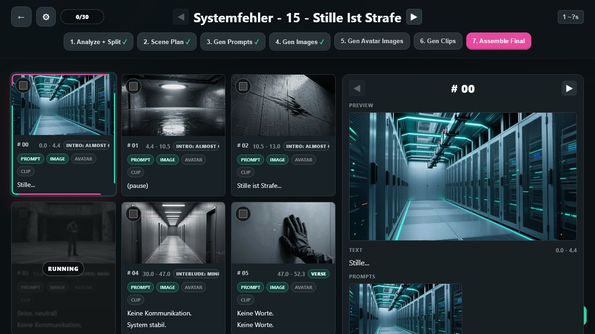
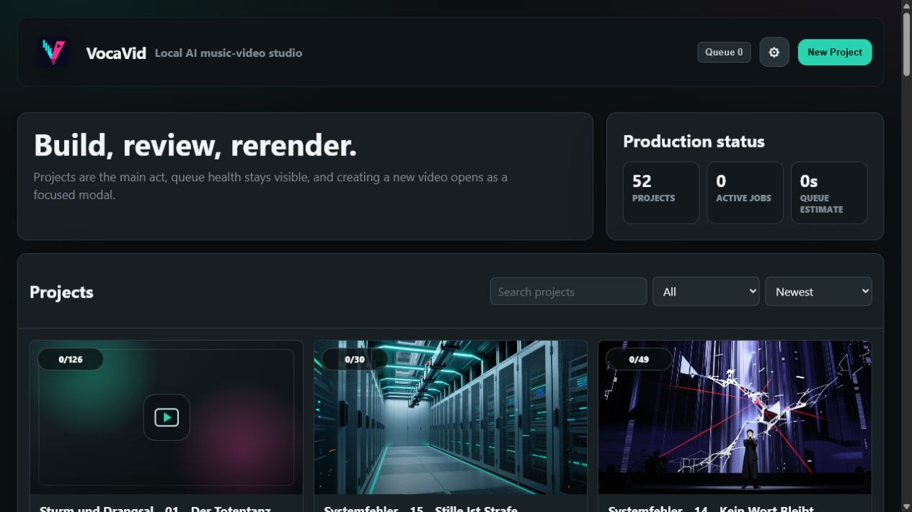
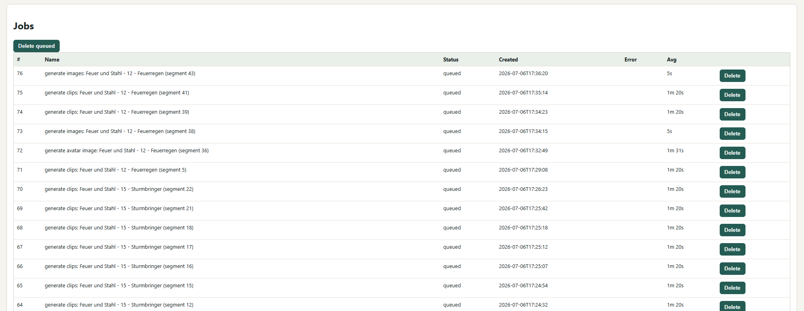

# VocaVid

[](LICENSE)
[](https://www.python.org/)
[](SECURITY.md)
[](CONTRIBUTING.md)

VocaVid is a local orchestration app for turning a WAV file, SUNO-style lyrics,
a genre/style idea, ComfyUI workflow templates, and reference images into a
resumable music-video render.

It runs as a small local FastAPI web app. Project state lives in SQLite,
generated assets stay under `.musicvideogen/`, generation jobs are sent to a
local ComfyUI server, and the final video can be assembled from approved clips.



## Highlights

- Build reusable music-video projects from audio, lyrics, style prompts, and
  reference images.
- Align lyrics with `faster-whisper`, with a deterministic timing fallback when
  transcription is unavailable or uncertain.
- Generate scene plans, image prompts, still images, avatar/reference-person
  variants, image-to-video prompts, video clips, and final assemblies.
- Inspect and edit every intermediate prompt before spending render time on the
  next stage.
- Rerun individual lines or segments instead of regenerating an entire video.
- Mark approved clips with `OK`; locked rows are skipped by later batch and redo
  actions.
- Track the global render queue in the project header and browser tab title.
- Keep uploads, generated media, databases, logs, and caches out of Git.

## Screenshots

| Project setup and project list | Queue view |
| --- | --- |
|  |  |

## Sample generated Video

 
(compressed)

## Quick Start

Requirements:

- Python 3.11 or newer recommended.
- A running ComfyUI instance, usually at `http://127.0.0.1:8188`.
- ComfyUI workflows exported into the local `workflows/` folder.
- `ffmpeg` available on `PATH` for audio splitting and final assembly.
- Optional but recommended: a CUDA-capable GPU for faster Whisper alignment.

Install dependencies:

```powershell
pip install -r requirements.txt
```

Run VocaVid:

```powershell
python -m musicvideogen serve
```

Then open:

```text
http://127.0.0.1:8000
```

The server also accepts custom host and port values:

```powershell
python -m musicvideogen serve --host 127.0.0.1 --port 8001
```

There is also a batch file for this local machine:

```powershell
start.bat
```

## How the Workflow Feels

1. Start ComfyUI.
2. Put the required ComfyUI workflow JSON files into `workflows/`.
3. Start VocaVid with `python -m musicvideogen serve`.
4. Create a project with a WAV file, SUNO-style lyrics, genre/style text,
   reference images, resolution, FPS, and segment grouping settings.
5. Click `Align` to align lyrics and build render segments.
6. Review and adjust line or segment timing where needed.
7. Click `Scene Plan`, then edit and save the plan if needed.
8. Generate image prompts, images, avatar images, video prompts, and clips.
9. Review clips row by row, switch between `Image` and `Avatar` sources, and
   mark good clips with `OK`.
10. Click `Assemble Final`.

Most actions can run on selected rows only. Failed or weak segments can be
rerendered without losing the rest of the project, and rows marked `OK` are
treated as locked even when selected.

## Why This Exists

VocaVid started after Sora, OpenAI's video generation option, was no longer
available for the workflow I wanted. The existing alternatives were fairly
expensive, and in the end they usually produced one finished video. That is
awkward for music-video work: if one section turns out weak, I do not want to
regenerate and pay for the whole thing again.

The goal became simple: use local tools, avoid paying per attempt, and make the
process resumable at the level of individual lyrics, prompts, images, and
clips. After finding ComfyUI, the remaining problem was automation: connecting
lyrics, scene planning, prompts, image generation, video generation, retries,
approvals, and final assembly into one repeatable local workflow.

This project has grown through a lot of Codex-assisted vibe coding: most of the
app was shaped in close human/AI collaboration, with quick iteration, local
tests, and a healthy amount of "what if we made this nicer?" energy.

## Feature Overview

### Project Setup

- Create projects from WAV audio, lyrics files, genre/style prompts, and one or
  more reference images.
- Configure resolution, FPS, transition handles, Whisper model, normal segment
  size, and chorus/refrain segment size.
- Keep each project resumable through local SQLite state.

### Lyrics and Segments

- Parse SUNO-style section tags such as `[Verse]`, `[Bridge]`, `[Chorus]`, and
  `[Refrain]`.
- Align lyric lines with `faster-whisper` word timestamps.
- Fall back to even timing when transcription is unavailable or uncertain.
- Group lyric lines into render segments, with separate group sizes for normal
  sections and chorus/refrain sections.
- Highlight low-confidence rows so timing can be corrected manually.

### Prompting and Planning

- Generate or edit a full scene plan before rendering.
- Generate global style text, image prompts, and image-to-video motion prompts.
- Use per-row `Save` buttons to preserve manual edits.
- Use `AI fill` to turn rough prompt drafts into production-ready scene
  prompts.
- Fall back to deterministic local prompt text where possible when the prompt
  generation workflow is unavailable.

### Rendering and Review

- Generate still images, avatar/reference-person image variants, video clips,
  and final assembled outputs.
- Choose whether each clip uses the base image or avatar image source.
- Retry selected rows without restarting the whole render.
- Mark generated videos as approved with `OK`; approved rows are protected and
  skipped by later batch, selected-row, and redo generation actions.
- Track queued/running jobs in the project header, browser tab title, and jobs
  view.

## Workflow Files

Default workflow lookup is handled by `musicvideogen/workflows.py`.

| Purpose | Preferred file | Fallback/alias | Required |
| --- | --- | --- | --- |
| Text generation for global style, scene plan, image prompts, and video prompts | `workflows/promptgen.json` | none | No |
| Still image generation | `workflows/image.json` | `workflows/image_z_image_turbo.json` | Yes |
| Reference-image still generation | `workflows/image_reference.json` | falls back to image workflow | No |
| Avatar/reference-person image edit | `workflows/avatartoimage_flux.json` | none | Yes for `Gen Avatar Image` |
| Image/audio-to-video generation | `workflows/video.json` | `workflows/imageaudiotovideo.json` | Yes for `Gen Clips` |
| Chorus-specific workflow | `workflows/chorus.json` | none | Present in code, not part of the main UI path yet |

The repository includes example workflow files for the current local setup:

- `workflows/promptgen.json`
- `workflows/image_z_image_turbo.json`
- `workflows/avatartoimage_flux.json`
- `workflows/imageaudiotovideo.json`

Exported ComfyUI UI-format workflows are accepted; VocaVid converts them to API
prompt format internally.

## Prompt Templates

Prompt instructions live in `prompts/` and can be edited without touching code:

- `prompts/global_style.txt`
- `prompts/sceneplan_concept.txt`
- `prompts/sceneplan.txt`
- `prompts/promptgen.txt`
- `prompts/scenefill.txt`
- `prompts/videoprompt.txt`
- `prompts/avatar_image.txt`

`prompts/scenefill.txt` powers the row-level `AI fill` buttons. If
`workflows/promptgen.json` is missing, VocaVid falls back to deterministic local
prompt text for image and video prompts where possible. Scene plans also have a
local fallback.

## Template Variables

Workflow JSON and prompt templates can use either `{{ name }}` or `{NAME}` style
placeholders.

Common variables:

- `lyric_text` / `LYRIC_TEXT`
- `lyrics` / `LYRICS`
- `section` / `SECTION`
- `is_chorus` / `IS_CHORUS`
- `use_reference_image`
- `mode` / `MODE`
- `global_style` / `GLOBAL_STYLE`
- `genre` / `GENRE`
- `duration` / `DURATION`
- `fps`
- `output_resolution`
- `scene_plan` / `SCENE_PLAN`

Image and video workflow variables:

- `prompt`
- `image_prompt` / `IMAGE_PROMPT`
- `video_prompt`
- `reference_image_paths`
- `reference_image_path`
- `reference_image_name`
- `fullbody_reference_image_path`
- `fullbody_reference_image_name`
- `base_image_path`
- `avatar_image_path`
- `source_image_path`
- `input_image_path`
- `image_path`
- `audio_path`

Scene-plan prompt variables:

- `total_segments` / `TOTAL_SEGMENTS`
- `lyric_group_size` / `LYRIC_GROUP_SIZE`
- `chorus_group_size` / `CHORUS_GROUP_SIZE`
- `first_index` / `FIRST_INDEX`
- `last_index` / `LAST_INDEX`
- `segments` / `SEGMENTS`
- `video_bible_context` / `VIDEO_BIBLE_CONTEXT`

## Reference Images and Chorus Shots

Lyrics are parsed from SUNO-style section tags such as `[Verse]`, `[Bridge]`,
`[Chorus]`, and `[Refrain]`.

Chorus/refrain sections are treated as reference-capable performance shots by
default. Individual lyric lines can also force reference-image use with an
inline tag:

```text
[me] I stand in the smoke
```

The `[me]` tag is removed from the renderable lyric text. The first uploaded
reference image is exposed as `reference_image_path`, and bundled fallback
images under `images/` are used when no project reference image is available.

## Local State and Outputs

Runtime files are intentionally local-only:

- `.musicvideogen/` contains uploads, generated outputs, and per-project assets.
- `musicvideogen.sqlite3` contains project state.
- `.musicvideogen-server*.log` files contain local server logs.
- `__pycache__/` contains Python bytecode.

These paths are ignored by Git. Do not commit generated media or local databases
unless you explicitly intend to publish them.

## CLI Batch Render

After a project exists, this command runs the full pipeline for that project ID:

```powershell
python -m musicvideogen run --project 1
```

It performs even alignment, builds segments, generates a scene plan, prompts,
images, clips, and then assembles the final output. The web UI is usually safer
for real projects because it lets you inspect, correct, rerun, and approve
intermediate results.

## Tests

Run the test suite with:

```powershell
python -m unittest discover -s tests
```

The tests cover workflow conversion, prompt/template behavior, alignment logic,
UI HTML generation, project actions, segment planning, and assembly helpers.

## Troubleshooting

### ComfyUI connection fails

Check that ComfyUI is running and that the project setting points to the right
base URL. The default is:

```text
http://127.0.0.1:8188
```

### Missing workflow error

Put the expected workflow JSON into `workflows/`. For image and video
generation, aliases are accepted:

- image: `image.json` or `image_z_image_turbo.json`
- video: `video.json` or `imageaudiotovideo.json`

### Whisper alignment is slow or falls back

`faster-whisper` uses CUDA when available, then retries on CPU when CUDA fails
or times out. Low-confidence rows are highlighted in the UI and can be corrected
manually.

### Clips do not assemble

Make sure `ffmpeg` is available on `PATH` and that
`templates/kdenlivetemplate.kdenlive` exists. Generated project media is stored
under `.musicvideogen/outputs/`.

### Push/commit hygiene

Before committing changes:

```powershell
git status
git diff
```

The `.gitignore` is set up to keep local runtime data, generated outputs, logs,
SQLite files, and Python caches out of commits.

## Contributing and Security

Contributions are welcome; see [CONTRIBUTING.md](CONTRIBUTING.md) for setup and
pull request guidance.

Please do not report security vulnerabilities in public issues. See
[SECURITY.md](SECURITY.md) for the private reporting process.
