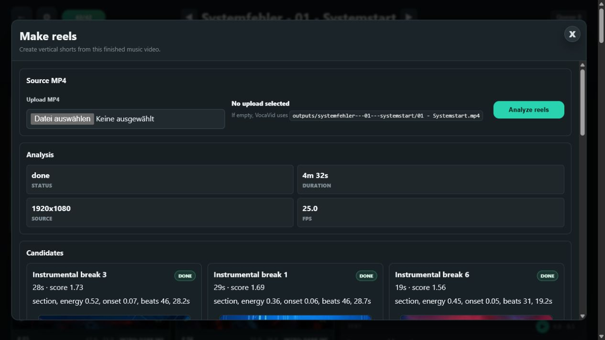

# VocaVid

[](LICENSE)
[](https://www.python.org/)
[](SECURITY.md)
[](CONTRIBUTING.md)

VocaVid is a local orchestration app for turning a WAV file, SUNO-style lyrics,
a genre/style idea, ComfyUI workflow templates, and reference images into a
resumable music-video render.

It runs as a small local FastAPI web app with a storyboard-first review UI.
Project state lives in SQLite, generated assets stay under `.VocaVid/`,
generation jobs are sent to a local ComfyUI server, and the final video can be
assembled from approved clips.


## Highlights

- Build reusable music-video projects from audio, lyrics, style prompts, and
  reference images.
- Align lyrics with `faster-whisper`, with a deterministic timing fallback when
  transcription is unavailable or uncertain.
- Generate scene plans, image prompts, still images, avatar/reference-person
  variants, image-to-video prompts, video clips, and final assemblies.
- Review projects from a visual dashboard with searchable project cards and
  progress badges.
- Set reusable global defaults, including an avatar identity, that are applied
  to new projects while each project remains independently editable.
- Work in a storyboard-first project view with segment cards, media previews,
  status chips, and a focused, resizable inspector for prompts and approvals.
- Switch to the advanced table view when dense timing, line, and diagnostic
  editing is useful.
- Rerun individual lines or segments instead of regenerating an entire video,
  while approved clips stay protected from later batch actions.
- Create vertical reel candidates from a finished/uploaded MP4 with Whisper
  lyric alignment plus beat/energy scoring, then render quick previews or final
  exports.
- Add precisely timed instrumental or interlude segments between lyric lines
  when the song needs visual breathing room.
- Track the global render queue from the top bar, queue modal, and browser tab
  title.
- Keep uploads, generated media, databases, logs, and caches out of Git.

## Screenshots

| Project dashboard | Storyboard and inspector |
| --- | --- |
|  |  |

| Reels workflow | Queue modal |
| --- | --- |
|  |  |

## Sample generated Video

<video src="https://github.com/user-attachments/assets/b8f790c5-25cf-4209-939d-533e54425808" width="100%" controls></video>
Sample clip from Feuer & Stahl - 12 - Feuerregen (compressed)

## Quick Start

Requirements:

- Python 3.11 or newer recommended.
- A running ComfyUI instance, usually at `http://127.0.0.1:8188`.
- ComfyUI workflows exported into the local `workflows/` folder.
- `ffmpeg` available on `PATH` for audio splitting and final assembly.
- Reels analysis also uses `librosa` from `requirements.txt` for beat/energy
  scoring.
- Optional but recommended: a CUDA-capable GPU for faster Whisper alignment.

Install dependencies:

```powershell
pip install -r requirements.txt
```

Run VocaVid:

```powershell
python -m VocaVid serve
```

Then open:

```text
http://127.0.0.1:8000
```

The server also accepts custom host and port values:

```powershell
python -m VocaVid serve --host 127.0.0.1 --port 8001
```

There is also a batch file for this local machine:

```powershell
start.bat
```

## How the Workflow Feels

1. Follow the [ComfyUI Quick Start Guide](https://docs.comfy.org/get_started) to install and launch ComfyUI.
2. Load the workflow JSON files from VocaVid's `workflows/` folder into ComfyUI.
3. ComfyUI will likely show errors because some models or custom nodes are missing.
4. Install the missing custom nodes and download the required models.
5. Keep in mind that the required model files can take up several gigabytes of disk space.
6. Once all dependencies are installed, ComfyUI is ready to run the workflows and use them with VocaVid.

After the initial setup, the normal VocaVid workflow looks like this:

1. Start ComfyUI.
2. Start VocaVid with `python -m VocaVid serve`.
3. Create a project from the dashboard with `New Project`. The modal asks for a
   WAV file, SUNO-style lyrics, Whisper model, and segment grouping settings.
4. Click `Analyze + Split` to align lyrics and build render segments. For
   exact placement of instrumental passages, use the manual timing editor to
   add interludes between lyric lines.
5. Review the storyboard cards and open the inspector for the segment that needs
   attention.
6. Click `Scene Plan`, then edit and save the plan if needed.
7. Generate prompts, images, avatar images, and clips.
8. Review clips in the storyboard, switch between `Image` and `Avatar` sources,
   and mark good clips with `OK`.
9. Use the advanced table view when you need compact timing or line-level
   editing.
10. Click `Assemble Final` to write the editable Kdenlive project.
11. Click `Render MP4` to render the final video. If the MP4 already exists,
    the same button opens it in the lightbox instead of rendering again.
12. Optional: open `Make reels` on the project page to analyze a finished MP4,
    review short-form candidates, render previews, and export final vertical
    reels.

Most actions can run on selected storyboard cards or advanced-table rows only.
Failed or weak segments can be rerendered without losing the rest of the
project, and items marked `OK` are treated as locked even when selected.

## Why This Exists

VocaVid started after Sora, OpenAI's video generation option, was no longer
available for the workflow I wanted. The existing alternatives were fairly
expensive, and in the end they usually produced one finished video. That is
awkward for music-video work: if one section turns out weak, I do not want to
regenerate and pay for the whole thing again.

The goal became simple: use local tools, avoid paying per attempt, and make the
process resumable at the level of individual lyrics, prompts, images, and
clips. After finding ComfyUI, the remaining problem was automation: connecting
lyrics, scene planning, prompts, image generation, video generation, retries,
approvals, and final assembly into one repeatable local workflow.

This project has grown through a lot of Codex-assisted vibe coding: most of the
app was shaped in close human/AI collaboration, with quick iteration, local
tests, and a healthy amount of "what if we made this nicer?" energy.

## Feature Overview

### Dashboard and Project Setup

- Browse projects as visual cards with progress counts, status media, search,
  completion filtering, and newest/oldest sorting.
- Create projects from a focused `New Project` modal using WAV audio and lyrics
  files.
- Configure resolution, FPS, transition handles, Whisper model, normal segment
  size, chorus/refrain segment size, genre/style prompts, and reference images
  from the project settings panel.
- Save global defaults for the initial project setup, including default avatar
  image, gender and face description, queue cleanup behavior, and shutdown
  after the queue completes.
- Keep each project resumable through local SQLite state.

### Lyrics and Segments

- Parse SUNO-style section tags such as `[Verse]`, `[Bridge]`, `[Chorus]`, and
  `[Refrain]`.
- Align lyric lines with `faster-whisper` word timestamps.
- Fall back to even timing when transcription is unavailable or uncertain.
- Group lyric lines into render segments, with separate group sizes for normal
  sections and chorus/refrain sections.
- Highlight low-confidence rows so timing can be corrected manually.
- Add, remove, and time interludes or instrumental passages between lyric lines
  with the manual timing editor; these become first-class render segments.

### Prompting and Planning

- Generate or edit a full scene plan before rendering.
- Plan long songs in continuous batches with video-bible handoffs, so scene
  direction carries across the entire project instead of resetting mid-song.
- Generate global style text, image prompts, and image-to-video motion prompts.
- Use per-row `Save` buttons to preserve manual edits.
- Use `AI fill` to turn rough prompt drafts into production-ready scene
  prompts.
- Fall back to deterministic local prompt text where possible when the prompt
  generation workflow is unavailable.

### Rendering and Review

- Generate still images, avatar/reference-person image variants, video clips,
  and final assembled outputs.
- `Assemble Final` writes an editable `.kdenlive` project under the project
  output folder. The folder keeps the slug name, while the Kdenlive file and
  rendered MP4 use a readable project-based filename such as
  `02 - Mauern aus Blut.kdenlive` and `02 - Mauern aus Blut.mp4`.
- Final assembly uses two video tracks and one audio track, with overlap handles
  and visible luma/wipe transitions between alternating video tracks.
- `Render MP4` uses Kdenlive/MLT `melt` to render the generated project. When a
  rendered MP4 is already present, the project page updates the button to open
  a video preview lightbox.
- Review segments as storyboard cards with image/video previews, timing, section
  labels, generation status, and locked/running overlays.
- Use the inspector to edit prompts, compare selected media, approve clips, and
  navigate between segments without losing context. The inspector can be
  resized, and project polling avoids replacing actively reviewed media.
- Choose whether each clip uses the base image or avatar image source.
- Apply avatar identity context directly to video prompts, helping generated
  clips retain the selected person across shots.
- Retry selected segments without restarting the whole render.
- Mark generated videos as approved with `OK`; approved rows are protected and
  skipped by later batch, selected-row, and redo generation actions.
- Track queued/running jobs in the project header, browser tab title, and queue
  modal.

### Reels

- Open `Make reels` from a project page to create vertical short-form cuts from
  an existing MP4.
- By default, VocaVid looks for the named render MP4 in
  `outputs/<project-slug>/`, then falls back to legacy `final.mp4` and
  `finished.mp4`. You can also upload a source MP4 directly in the Reels modal.
- Reels analysis extracts audio, runs Whisper word alignment against the
  project's lyrics, scores sections with `librosa` energy/onset/beat features,
  and generates ranked candidates.
- Candidate cards show the title, duration, score, scoring reasons, status, and
  one video player. If an export exists, the player uses the export; otherwise
  it uses the preview.
- `Preview` renders a smaller 9:16 MP4 under
  `.VocaVid/outputs/<project-slug>/reels/previews/`.
- `Export` renders a final 1080x1920 MP4 directly under
  `.VocaVid/outputs/<project-slug>/reels/`.
- `Clear` removes preview/export files for a candidate while keeping the
  candidate. `Delete` removes the candidate completely.
- Reel filenames include the candidate title and id, for example
  `reel-chorus-3-006-export.mp4`, so repeated titles stay unique.

## Workflow Files

Default workflow lookup is handled by `VocaVid/workflows.py`.

| Purpose | Preferred file | Fallback/alias | Required |
| --- | --- | --- | --- |
| Text generation for global style, scene plan, image prompts, and video prompts | `workflows/promptgen.json` | none | No |
| Still image generation | `workflows/image.json` | `workflows/image_z_image_turbo.json` | Yes |
| Reference-image still generation | `workflows/image_reference.json` | falls back to image workflow | No |
| Avatar/reference-person image edit | `workflows/avatartoimage_flux.json` | none | Yes for `Gen Avatar Image` |
| Image/audio-to-video generation | `workflows/video.json` | `workflows/imageaudiotovideo.json` | Yes for `Gen Clips` |
| Chorus-specific workflow | `workflows/chorus.json` | none | Present in code, not part of the main UI path yet |

The repository includes example workflow files for the current local setup:

- `workflows/promptgen.json`
- `workflows/image_z_image_turbo.json`
- `workflows/avatartoimage_flux.json`
- `workflows/imageaudiotovideo.json`

Exported ComfyUI UI-format workflows are accepted; VocaVid converts them to API
prompt format internally.

## Prompt Templates

Prompt instructions live in `prompts/` and can be edited without touching code:

- `prompts/global_style.txt`
- `prompts/sceneplan_concept.txt`
- `prompts/sceneplan.txt`
- `prompts/promptgen.txt`
- `prompts/scenefill.txt`
- `prompts/videoprompt.txt`
- `prompts/avatar_image.txt`

`prompts/scenefill.txt` powers the row-level `AI fill` buttons. If
`workflows/promptgen.json` is missing, VocaVid falls back to deterministic local
prompt text for image and video prompts where possible. Scene plans also have a
local fallback.

## Template Variables

Workflow JSON and prompt templates can use either `{{ name }}` or `{NAME}` style
placeholders.

Common variables:

- `lyric_text` / `LYRIC_TEXT`
- `lyrics` / `LYRICS`
- `section` / `SECTION`
- `is_chorus` / `IS_CHORUS`
- `use_reference_image`
- `mode` / `MODE`
- `global_style` / `GLOBAL_STYLE`
- `genre` / `GENRE`
- `duration` / `DURATION`
- `fps`
- `output_resolution`
- `scene_plan` / `SCENE_PLAN`

Image and video workflow variables:

- `prompt`
- `image_prompt` / `IMAGE_PROMPT`
- `video_prompt`
- `reference_image_paths`
- `reference_image_path`
- `reference_image_name`
- `fullbody_reference_image_path`
- `fullbody_reference_image_name`
- `base_image_path`
- `avatar_image_path`
- `source_image_path`
- `input_image_path`
- `image_path`
- `audio_path`

Scene-plan prompt variables:

- `total_segments` / `TOTAL_SEGMENTS`
- `lyric_group_size` / `LYRIC_GROUP_SIZE`
- `chorus_group_size` / `CHORUS_GROUP_SIZE`
- `first_index` / `FIRST_INDEX`
- `last_index` / `LAST_INDEX`
- `segments` / `SEGMENTS`
- `video_bible_context` / `VIDEO_BIBLE_CONTEXT`

## Reference Images and Chorus Shots

Lyrics are parsed from SUNO-style section tags such as `[Verse]`, `[Bridge]`,
`[Chorus]`, and `[Refrain]`.

Chorus/refrain sections are treated as reference-capable performance shots by
default. Individual lyric lines can also force reference-image use with an
inline tag:

```text
[me] I stand in the smoke
```

The `[me]` tag is removed from the renderable lyric text. Additional lyric meta
tags are stripped from renderable text where supported, so prompt/control hints
do not leak into the final lyric line. The first uploaded reference image is
exposed as `reference_image_path`, and bundled fallback images under `images/`
are used when no project reference image is available.

## Local State and Outputs

Runtime files are intentionally local-only:

- `.VocaVid/` contains uploads, generated outputs, and per-project assets.
- `VocaVid.sqlite3` contains project state.
- `.VocaVid-server*.log` files contain local server logs.
- `__pycache__/` contains Python bytecode.

These paths are ignored by Git. Do not commit generated media or local databases
unless you explicitly intend to publish them.

## CLI Batch Render

After a project exists, this command runs the full pipeline for that project ID:

```powershell
python -m VocaVid run --project 1
```

It performs even alignment, builds segments, generates a scene plan, prompts,
images, clips, and then assembles the final output. The web UI is usually safer
for real projects because it lets you inspect, correct, rerun, and approve
intermediate results.

## Tests

Run the test suite with:

```powershell
python -m unittest discover -s tests
```

The tests cover workflow conversion, prompt/template behavior, alignment logic,
UI HTML generation, project actions, segment planning, and assembly helpers.

## Troubleshooting

### ComfyUI connection fails

Check that ComfyUI is running and that the project setting points to the right
base URL. The default is:

```text
http://127.0.0.1:8188
```

### Missing workflow error

Put the expected workflow JSON into `workflows/`. For image and video
generation, aliases are accepted:

- image: `image.json` or `image_z_image_turbo.json`
- video: `video.json` or `imageaudiotovideo.json`

### Whisper alignment is slow or falls back

`faster-whisper` uses CUDA when available, then retries on CPU when CUDA fails
or times out. Low-confidence rows are highlighted in the UI and can be corrected
manually.

### Clips do not assemble

Make sure `ffmpeg` is available on `PATH` and that
`templates/kdenlivetemplate.kdenlive` exists. Generated project media is stored
under `.VocaVid/outputs/`.

### Reels analysis seems stuck

Reels analysis uses Whisper and can compete with ComfyUI video generation for
GPU/VRAM. If ComfyUI is rendering clips at the same time, Reels analysis may
appear idle while waiting on transcription. Let the queue finish, or run Reels
when the GPU is less busy.

### Reels preview/export fails

VocaVid renders Reels with FFmpeg. On Windows, if the default FFmpeg lacks
`libx264`, the Reels renderer uses an available H.264 encoder such as
MediaFoundation (`h264_mf`) where possible. Check the candidate error text in
the Reels card and the local `.vocavid-server-*.err.log` if a render fails.

### Push/commit hygiene

Before committing changes:

```powershell
git status
git diff
```

The `.gitignore` is set up to keep local runtime data, generated outputs, logs,
SQLite files, and Python caches out of commits.

## Contributing and Security

Contributions are welcome; see [CONTRIBUTING.md](CONTRIBUTING.md) for setup and
pull request guidance.

Please do not report security vulnerabilities in public issues. See
[SECURITY.md](SECURITY.md) for the private reporting process.
